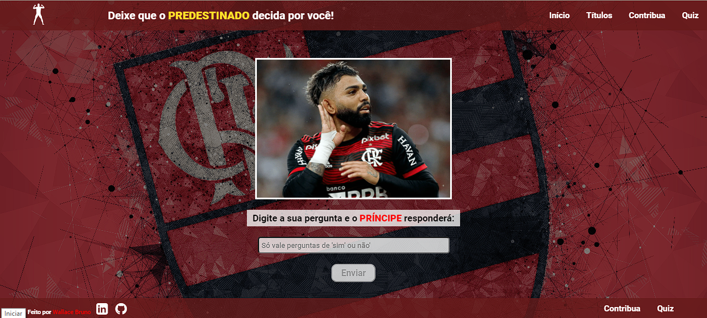

# Pergunte ao Gabigol

Projeto feito em homenagem ao Gabigol, usando html, css e javascript. Trata-se de um sistema de perguntas de "sim ou não" em que é feito um sorteio entre 0 e 1 para decidir se a resposta será SIM ou NÃO. A partir da resposta, o DOM é manipulado e altera a imagem e o display com a resposta fica visível. O site está responsivo para diversos tamanhos de tela.

Algumas funcionalidades, como o Quiz, ainda serão adicionadas.

## 🚀 Sobre mim
Eu sou Desenvolvedor Front-end e venho postando meus projetos aqui no Github frequentemente. As principais tecnologias utilizadas até então são: HTML, CSS, Javascript, Bootstrap e um pouco de React.

## Meu contato

📫 Você pode entrar em contato comigo pelo linkedin: https://www.linkedin.com/in/wallacebps/

## Screenshots

## Referência

 - [W3Schools](https://getbootstrap.com/)
 - [Mozilla](https://developer.mozilla.org/)

 

## Tecnologias utilizadas

**Front-end:** HTML, CSS, Javascript, Git.

## 🔗 Links

